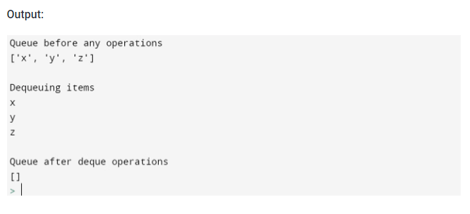

# 02 Queue
## What is a Queue??

A queue in python is a data structure that has a front and a rear. It stores items in an First In First Out manner (FIFO). This means that the it operates similar to a normal line of people. As items come into it they are added to the back. To remove an item, it is taken from the front. 

## When to Use?
* We use a queue to store information 
* When we want a specific order
* Allows us to find data by a specific location

## Some Advatages
* It is dynamic (meaning can be chagned)
* it is an efficient means storing data
* Items can be added or removed with a complexity of O(1)
* The Advantage over Arrays is that it can be added to and subtracted from

## Some commands to use with a queue
Here are some common examples of code to work on a queue
* ` put(item): ` Inserts an elemnt to the queue
* ` get(): ` Gets an element from the queue
* ` empty(): ` Checks and returns true if the queue is empty
* `qsize: ` Returns the queue's length
* ` full(): ` Checks and returns true if the queue is full
* ` maxsize(): ` Maximum elemnts allowed in a queue
 ## How to implement a Queue in python with a list
  ` # Initialize a queue `

`queue_exm = []`

` # Adding elements to the queue`

`queue_exm.append('x')`

`queue_exm.append('y')`

`queue_exm.append('z')`

`print("Queue before any operations")`

`print(queue_exm)`

`# Removing elements from the queue`

`print("\nDequeuing items")`

`print(queue_exm.pop(0))`

`print(queue_exm.pop(0))`

`print(queue_exm.pop(0))`

`print("\nQueue after deque operations")`

`print(queue_exm)`

