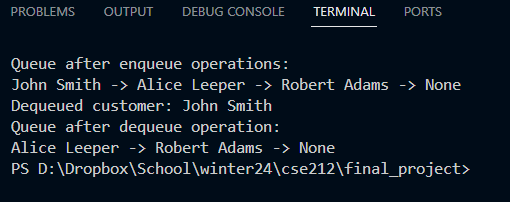
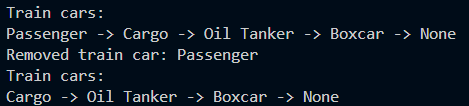

# Linked Lists
## What is a linked list?
A linked list is a method of stroing data in Python that allows either a single or double linked "nodes". If it sis a single linked then the information only will travel in a single direction, while a double linked list allows the last as well as the first items to be linked. 

## What is the benefits?
* This allows infortamtion to be added and removed without having to change the index of the items
* Memory usage is limited due to no need to store contiguously.
* While is does not have a O(1) like an array, it is a O(n) of time complexity.

## When to use?
* You want to insert items easily in between other items
* The size of the total collection is unknown
* You don’t need random access when searching for items
* There is no concern about memory usage for storing the data

 ## Commands to use
 * `insert()`
 * `find()`
 * `remove()`
 * `is_empty()`
 * `get_count()`

  ## What to remebmer
  * There is no natural data structure Python code for linked lists
  * Before we can use a linked list, we need to create a Node Class
  * We need to create the behaviors that allow us to access the data from each node
  * We need to create the ability to set or adjust these behaviors as well

## Code to intialize a Node 
```python
Class Node(object):

    def __init__(self, val):
        self.val = val
        self.next = None

    def get_data(self):
        return self.val

    def set_data(self, val):
        self.val = val
 
    def get_next(self):
        return self.next
 
    def set_next(self, next):
        self.next = next
```
## Here are some examples of what a visualation of what a linked list looks like

As you can see, it is composed of a head and a tail. When you add and "x" to it. It is put on the tail of the list. When you give the command to remove and item, the first item, an "a" is removed. The command pop() removes from the front and the command push() adds to the front.
## How to build a single linked list
```python
Class LinkedList(object):

    def __init__(self, head = None):
        self.head = head
        self.count = 0
```
## How to add items to a linked list
```python
    def insert(self, data):
        """
        Create a new node at the Head of the Linked List

        """ 

        #create a new node to hold the data
        new_node = Node(data)
        
        #set the next of the new node to the current head
        new_node.set_next(self.head)

        #set the head of the Linked List to the new head
        self.head = new_node

        #add 1 to the count
        self.count += 1
```

## How to search over a linked list
```python
def find(self, val):
        """
        Search for item in Linked List with data = val
        
        Time complexity is O(n) 
        """
        #start with the first item in the Linked List
        item = self.head

        #then iterate over the next nodes
        #but if item = None then end search
        while item != None:
           
           #if the data in item matched val
           #then return item
           if item.get_data() == val:
               return item
           
           #otherwise we get the next item in the list
           else:
                item = item.get_next()

        #if while loop breaks with None then nothing found
        #so we return None
        return None
```
## How to remove items
```python
   def remove(self, item):
        """
        Remove Node with value equal to item

        Time complexity is O(n) as in the worst case we have to 
        iterate over the whole linked list
        """

        #set the current node starting with the head
        current = self.head
        #create a previous node to hold the one before
        #the node we want to remove
        previous = None

        #while current is note None then we can search for it
        while current is not None:

            #if current equals to item then we can break
            if current.data == item:
                break

            #otherwise we set previous to current and 
            #current to the next item in list
            previous = current
            current = current.get_next()

        #if the current is None then item, not in the list
        if current is None:
            raise ValueError(f"{item} is not in the list")
        #if previous None then the item is at the head
        if previous is None:
            self.head = current.next
            self.count -= 1

        #otherwise then we remove that node from the list
        else:
             previous.set_next(current.get_next())
             self.count -= 1

```
## Common functions
```python
    def get_count(self):
        """
        Return the length of the Linked List

        Time complexity O(1) as only returning a single value
        """

        return self.count

    def is_empty(self):
    """
    Returns whether the Linked List is empty or not

    Time complexity O(1) as only returns True or False
    """

    #we only have to check the head if is None or not
    return self.head == None    

```
# Example problem using linked lists
## Create a program to handle the line in a bank
* use a enqueue for arriving customers
* use a dequeue function for customers that have been helped
* display the current line

## Here is the sample code
```python
class Node:
    def __init__(self, data):
        self.data = data
        self.next = None

class Queue:
    def __init__(self):
        self.front = None
        self.rear = None

    def enqueue(self, data):
        new_node = Node(data)
        if self.rear is None:
            self.front = new_node
            self.rear = new_node
        else:
            self.rear.next = new_node
            self.rear = new_node

    def dequeue(self):
        if self.front is None:
            print("Queue is empty")
            return None
        else:
            removed_data = self.front.data
            if self.front == self.rear:
                self.front = None
                self.rear = None
            else:
                self.front = self.front.next
            return removed_data

    def display(self):
        current = self.front
        while current:
            print(current.data, end=" -> ")
            current = current.next
        print("None")

# Example usage:
bank_queue = Queue()

# Enqueue customers
bank_queue.enqueue("John Smith")
bank_queue.enqueue("Alice Leeper")
bank_queue.enqueue("Robert Adams")

# Display queue
print("Queue after enqueue operations:")
bank_queue.display()

# Dequeue a customer
removed_customer = bank_queue.dequeue()
print(f"Dequeued customer: {removed_customer}")

# Display queue after dequeue operation
print("Queue after dequeue operation:")
bank_queue.display()
```
## Here is a link to the code

## Here is the expected output


# Create a linked list program that manages train cars 
## Requirements
* Have a function to add train cars
* Have a function to remove train cars
* Be able to display the train
## Here is the expected outcome

## Here is the solution

[Link to welcome page](0-welcome.md)